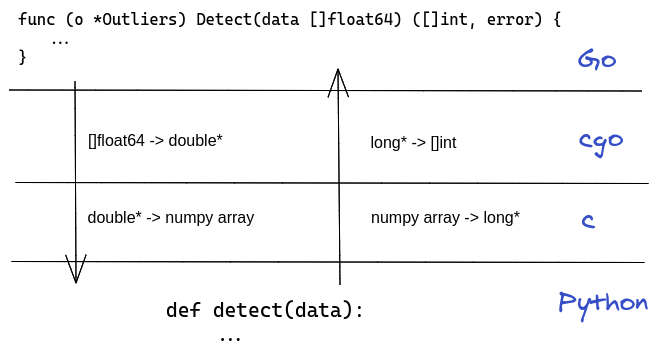

# Go ↔ Python: Part IV Using Python in Memory

### Introduction

In [a previous
post](https://www.ardanlabs.com/blog/2020/06/python-go-grpc.html) we used
[gRPC](https://grpc.io/) to call Python code from Go. gRPC is a great framework
but there is a performance cost to it - every function call need to marshal the
arguments ([protobuf](https://developers.google.com/protocol-buffers), make a
network call ([HTTP/2](https://en.wikipedia.org/wiki/HTTP/2)) and then
unmarshal the result (`protobuf` again).

In this blog post we'll get rid of the network layer and, to some extent, the
marshalling. We'll do this by using [cgo](https://golang.org/cmd/cgo/) to
interact with Python as a shared library.

_Note: This blog is not for the weak of heart - we'll pass Go slices directly
to Python, use Python allocated memory directly in Go and fool the Go compiler
with ugly tricks. You better have some harsh performance requirements to follow
this path. So buckle up Buttercup, it's going to be a wild ride._

### Python Code

The Python code uses [numpy](https://numpy.org/) to do [outlier
detection](https://en.wikipedia.org/wiki/Anomaly_detection) on a series of
floating point values.

**Listing 1: outliers.py**
```
01 import numpy as np
02 
03 
04 def detect(data):
05     """Return indices where values more than 2 standard deviations from mean"""
06     out = np.where(np.abs(data - data.mean()) > 2 * data.std())
07     # np.where returns a tuple for each dimension, we want the 1st element
08     return out[0]
```

On line 04 we define a function that accepts and numpy `array`. On line 06 we use [boolean indexing](https://numpy.org/devdocs/user/basics.indexing.html#boolean-or-mask-index-arrays) to find all the values that are more than 2 [standard deviations](https://en.wikipedia.org/wiki/Standard_deviation) from the mean. On line 08 we return the list of indices of the outliers.

### Embedding Python Overview

Most of the time you'll use Python via the `python` interpreter, but Python can also be used as a [shared library](https://en.wikipedia.org/wiki/Library_(computing)#Shared_libraries). Python has an [extensive C API](https://docs.python.org/3/c-api/index.html) and [a lot of documentation](https://docs.python.org/3/extending/index.html) on how to extend and embed Python.

The Python C-API is for, well ..., C. We are going to use `cgo` to glue Go and Python together. Here are the steps we'll follow:

1. Initialize the Python interpreter
2. Load the Python function (`detect` in our case) and store it in a variable
3. Call the Python function with a `[]float64` values and get back `[]int` of indices

The embedding code involves some C code which is written in it's own file - `glue.c`.


**Figure  1**  


Figure 1 shows the flow of data from Go to Python and back.

### Overview of Python's Internals

Every Python object is represented in C as a `PyObject *`. Each `PyObject *`
has a counter for how many variables point to it, this is used by Python's
[reference counting](https://en.wikipedia.org/wiki/Reference_counting) garbage
collector. Once you're done with a `PyObject *`, you need to call `Py_DECREF`
on it.

At the language level, Python uses exceptions. At the C level, things are
different. Python's C-API signal an error by returning `NULL`, you can use
`PyErr_Occurred` API function to get the last exception.

**Listing 2: glue.c `py_last_error`**
```
51 const char *py_last_error() {
52   PyObject *err = PyErr_Occurred();
53   if (err == NULL) {
54     return NULL;
55   }
56 
57   PyObject *str = PyObject_Str(err);
58   const char *utf8 = PyUnicode_AsUTF8(str);
59   Py_DECREF(str);
60   return utf8;
61 }
62 
```

Listing 2 show's the C part of error handling.
On line 52 we use `PyErr_Occurred` to get the last exception. On line 27 we
convert it to a Python `str` and on line 58 we convert the Python `str` to a C
`char *`.

**Listing 3: outliers.go `PyLastError`**
```
92 func pyLastError() error {
93 	cp := C.py_last_error()
94 	if cp == nil {
95 		return nil
96 	}
97 
98 	err := C.GoString(cp)
99 	// C.free(unsafe.Pointer(cp)) // FIXME
100 	return fmt.Errorf("%s", err)
101 }
```

Listing 3 show's Go implantation of handling Python errors. On line 93 we call
the C function and on line 98 we convert C `char *` to a Go string and on line
100 we convert the string to an `error`.

### Calling Python: Go -> C

**Listing ??: outliers.go `Detect`**
```
55 // Detect returns slice of outliers indices
56 func (o *Outliers) Detect(data []float64) ([]int, error) {
57 	carr := (*C.double)(&(data[0]))
58 	res := C.detect(o.pyFunc, carr, (C.long)(len(data)))
59 	runtime.KeepAlive(data)
60 	if res.err != 0 {
61 		return nil, pyLastError()
62 	}
63 
64 	// Convert C int* to []int
65 	indices := make([]int, res.size)
66 	ptr := unsafe.Pointer(res.indices)
67 	// Ugly hack to convert C.long* to []C.long
68 	cArr := (*[1 << 20]C.long)(ptr)
69 	for i := 0; i < len(indices); i++ {
70 		indices[i] = (int)(cArr[i])
71 	}
72 	C.free(ptr)
73 	return indices, nil
74 }
```


### Calling Python: Python -> C

We call Python via a C layer. The C layer need to pass data to Python and a
result and possible error value back.
Since C does not support multiple return values, we'll use a struct to hold the possible return values.

**Listing 4: glue.h `result_t` struct**
```
06 typedef struct {
07   long *indices;
08   long size;
09   int err;
10 } result_t;
```

Listing 4 show C's `result_t` struct that holds the return value.
On line 07 we have an array of indices and on line 08 we have its size.
On line 09 we have an `int` flag specifying if there was an error or not. We
can extract the error with `PyLastError`.


**Listing 5: glue.c `detect`**
```
30 result_t detect(PyObject *func, double *values, long size) {
31   result_t res = {NULL, 0};
32   npy_intp dim[] = {size};
33   PyObject *arr = PyArray_SimpleNewFromData(1, dim, NPY_DOUBLE, values);
34   if (arr == NULL) {
35     res.err = 1;
36     return res;
37   }
38   PyObject *args = PyTuple_New(1);
39   PyTuple_SetItem(args, 0, arr);
40   PyArrayObject *out = (PyArrayObject *)PyObject_CallObject(func, args);
41   if (out == NULL) {
42     res.err = 1;
43     return res;
44   }
45 
46   res.size = PyArray_SIZE(out);
47   res.indices = (long *)PyArray_GETPTR1(out, 0);
48   return res;
49 }
```


### Building

**Listing ???: outliers.go `cgo` Instructions**
```
01 package outliers
02 
03 import (
04 	"fmt"
05 	"runtime"
06 	"sync"
07 	"unsafe"
08 )
09 
10 /*
11 #cgo pkg-config: python3
12 #cgo LDFLAGS: -lpython3.8
13 
14 #include "glue.h"
15 
16 */
17 import "C"
```

Listing ??? shows the `cgo` instructions. On line 07 we import the [unsafe](https://golang.org/pkg/unsafe/) package so we'll be able to work with C pointers.
On line 11 we use the [pkg-config](https://www.freedesktop.org/wiki/Software/pkg-config/) to find C compiler directives for Python. On line 12 we tell `cgo` to use the Python shared library.
On line 14 we import the C code definitions from `glue.h` and on line 17 we have the `import "C"` directive that *must* come right after the comment.
