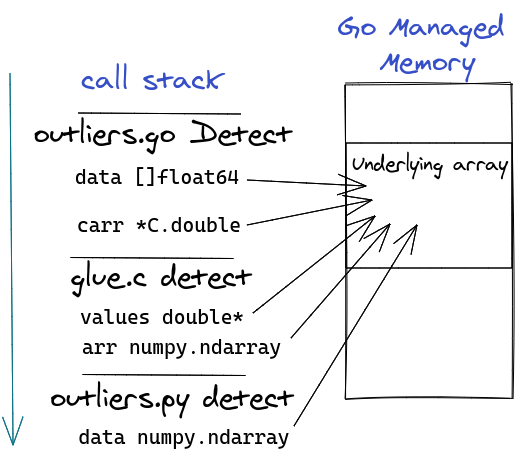
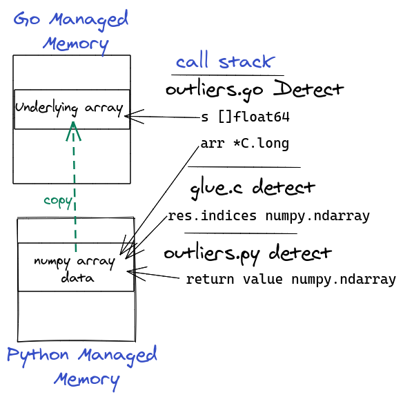

# Go ↔ Python: Part IV Using Python in Memory

### Introduction

In [a previous post](https://www.ardanlabs.com/blog/2020/06/python-go-grpc.html) we used [gRPC](https://grpc.io/) to call Python code from Go. gRPC is a great framework, but there is a performance cost to it. Every function call needs to marshal the arguments using [protobuf](https://developers.google.com/protocol-buffers), make a network call over [HTTP/2](https://en.wikipedia.org/wiki/HTTP/2), and then un-marshal the result using `protobuf`.

In this blog post, we'll get rid of the networking layer and to some extent, the marshalling. We'll do this by using [cgo](https://golang.org/cmd/cgo/) to interact with Python as a shared library.

I'm not going to cover all of the code in detail in order to keep this blog size down. You can find all the code on [github](https://github.com/ardanlabs/python-go/tree/master/py-in-mem) and I did my best to provide proper documentation. Feel free to reach out and ask me questions if you don’t understand something.

And finally, if you want to follow along, you’ll need to install the following (apart from Go):

* Python 3.8
* numpy
* A C compiler (such as gcc)

### A Crash Course in Python Internals

The version of Python most of us use is called `CPython`. It's written in C and is designed to be extended and embedded using C. In this section, we'll cover some topics that will help you understand the code I’m going to show.

_Note: The Python C API is well [documented](https://docs.python.org/3/c-api/index.html), and there’s even [a book](https://realpython.com/products/cpython-internals-book/) in the works._

In CPython, every value is a `PyObject *` and most of Python's API functions will return a `PyObject *` or will receive a `PyObject *` as an argument. Also, errors are signaled by returning `NULL`, and you can use the `PyErr_Occurred` function to get the last exception raised.

CPython uses a [reference counting](https://en.wikipedia.org/wiki/Reference_counting) garbage collector which means that every `PyObject *` has a counter for how many variables are referencing it. Once the reference counter reaches 0, Python frees the object's memory. As a programmer, you need to take care to decrement the reference counter using the `Py_DECREF`  C macro once you're done with an object.

### From Go to Python and Back Again

Our code tries to minimize memory allocations and avoid unnecessary serialization. In order to do this, we will share memory between Go and Python instead of allocating new memory and copying that data on each side of the function call and return. Sharing memory between two runtimes is tricky and you need to pay a lot of attention to who owns what piece of memory and when each runtime is allowed to release it.

**Figure  1**  



Figure 1 shows the flow of data from the Go function to the Python function.

Our input is a Go slice (`[]float64`) which has an underlying array in memory managed by Go. We will pass a pointer to the slice’s underlying array to C, which in turn will create a [numpy](https://numpy.org/) array that will use the same underlying array in memory. It’s this numpy array that will be passed as input to the Python outliers detection function called `detect`.

**Figure  2**  



Figure 2 shows the flow of data from the Python function back to the Go function.

When the Python `detect` function completes, it returns a new numpy array whose underlying memory is allocated and managed by Python. Like we did between Go and Python, we will share the memory back to Go by passing the Python pointer to the underlying numpy array (via C).

In order to simplify memory management, on the Go side once we have access to the numpy array pointer, we create a new Go slice (`[]int`) and copy the content of the numpy array inside.. Then we tell Python it can free the memory it allocated for the numpy array. 

After the call to `detect` completes, the only memory we are left with is the input (`[]float64`) and the output (`[]int`) slices  both being managed by Go. Any Python memory allocations should be released.

### Code Overview

Our Go code is going to load and initialize a Python shared library so it can call the `detect` function that uses numpy to perform [outlier detection](https://en.wikipedia.org/wiki/Anomaly_detection) on a series of floating point values.

These are the steps that we will follow:

* Convert the Go slice `[]float64` parameter to a C `double *` (`outliers.go`)
* Create a numpy array from the C `double *` (`glue.c`)
* Call the Python function with the numpy array (`glue.c`)
* Get back a numpy array with indices of outliers (`glue.c`)
* Extract C `long *` from the numpy array (`glue.c`)
* Convert the C `long *` to a Go slice `[]int` and return it from the Go function
  (`outliers.go`)

The Go code is in `outliers.go`, there's some C code in `glue.c`, and finally the outlier detection Python function is in `outliers.py`. I’m not going to show the C code, but if you're curious about it have a look at [glue.c](https://github.com/ardanlabs/python-go/blob/master/py-in-mem/glue.c).

**Listing 1: Example Usage**
```
15 	o, err := NewOutliers("outliers", "detect")
16 	if err != nil {
17 		return err
18 	}
19 	defer o.Close()
20 	indices, err := o.Detect(data)
21 	if err != nil {
22 		return err
23 	}
24 	fmt.Printf("outliers at: %v\n", indices)
25 	return nil
```

Listing 1 shows an example of how to use what we’re going to  build in Go. On line 15, we create an `Outliers` object which uses the function `detect` from the `outliers` Python module. On line 19, we make sure to free the Python object. On line 20, we call the `Detect` method and get the indices of the outliers in the data.

### Code Highlights

**Listing 2: outliers.go [initialize](https://github.com/ardanlabs/python-go/blob/master/py-in-mem/outliers.go#L25)**  
```
19 var (
20 	initOnce sync.Once
21 	initErr  error
22 )
23 
24 // initialize Python & numpy, idempotent
25 func initialize() {
26 	initOnce.Do(func() {
27 		C.init_python()
28 		initErr = pyLastError()
29 	})
30 }
```

Listing 2 shows how we initialize Python for use in our Go program. On line 20, we declare a variable of type [sync.Once](https://golang.org/pkg/sync/#Once) that will be used to make sure we initialize Python only once. On line 25, we create a function to initialize Python. On line 26, we call the `Do` method to call the initialization code and on line 28, we set the `initErr` variable to the last Python error.

**Listing 3: outliers.go [Outliers](https://github.com/ardanlabs/python-go/blob/master/py-in-mem/outliers.go#L32)**  
```
32 // Outliers does outlier detection
33 type Outliers struct {
34 	fn *C.PyObject // Outlier detection Python function object
35 }
```

Listing 3 shows the definition of the `Outliers` struct. It has one field on line 34 which is a pointer to the Python function object that does the actual outlier detection.

**Listing 4: outliers.go [NewOutliers](https://github.com/ardanlabs/python-go/blob/master/py-in-mem/outliers.go#L38)**  
```
37 // NewOutliers returns an new Outliers using moduleName.funcName Python function
38 func NewOutliers(moduleName, funcName string) (*Outliers, error) {
39 	initialize()
40 	if initErr != nil {
41 		return nil, initErr
42 	}
43 
44 	fn, err := loadPyFunc(moduleName, funcName)
45 	if err != nil {
46 		return nil, err
47 	}
48 
49 	return &Outliers{fn}, nil
50 }
```

Listing 4 shows the `NewOutliers` function that created an `Outliers` struct.  On lines 39-42, we make sure Python is initialized and there's no error. On line 44, we get a pointer to the Python `detect` function. This is the same as doing an `import` statement in Python. On line 49, we save this Python pointer for later use in the `Outliers` struct.
	
**Listing 5: outliers.go [Detect](https://github.com/ardanlabs/python-go/blob/master/py-in-mem/outliers.go#L52)**  
```
52 // Detect returns slice of outliers indices
53 func (o *Outliers) Detect(data []float64) ([]int, error) {
54 	if o.fn == nil {
55 		return nil, fmt.Errorf("closed")
56 	}
57 
58 	if len(data) == 0 { // Short path
59 		return nil, nil
60 	}
61 
62 	// Convert []float64 to C double*
63 	carr := (*C.double)(&(data[0]))
64 	res := C.detect(o.fn, carr, (C.long)(len(data)))
65 
66 	// Tell Go's GC to keep data alive until here
67 	runtime.KeepAlive(data)
68 	if res.err != 0 {
69 		return nil, pyLastError()
70 	}
71 
72 	indices, err := cArrToSlice(res.indices, res.size)
73 	if err != nil {
74 		return nil, err
75 	}
76 
77 	// Free Python array object
78 	C.py_decref(res.obj)
79 	return indices, nil
80 }

```

Listing 5 shows the code for the `Outliers.Detect` method. On line 63, we convert Go’s `[]float64` slice to a C `double *` by taking the address of the first element in the underlying slice value. On line 64, we call the Python `detect` function via CGO and we get back a result. On line 67, we tell Go's garbage collector that it can't reclaim the memory for `data` before this point in the program. On lines 68-70, we check if there was an error calling `detect`. On lines 72, we convert the C `double *` to a Go `[]int` slice. On line 79, we decrement the Python return value reference count.

**Listing 6: outliers.go [Outliers.Close](https://github.com/ardanlabs/python-go/blob/master/py-in-mem/outliers.go#L82) method**
```
82 // Close frees the underlying Python function
83 // You can't use the object after closing it
84 func (o *Outliers) Close() {
85 	if o.fn == nil {
86 		return
87 	}
88 	C.py_decref(o.fn)
89 	o.fn = nil
90 }
```

Listing 6 shows the 'Outliers.Close` method. On line 88, we decrement the Python function object reference count and on line 89, we set the `fn` field to `nil` to signal the `Outliers` object is closed.

### Building

The glue code is using header files from Python and numpy. In order to build, we need to tell [cgo](https://golang.org/cmd/cgo/) where to find these header files. 

**Listing 7: outliers.go [cgo directives](https://github.com/ardanlabs/python-go/blob/master/py-in-mem/outliers.go#L12)**
```
11 /*
12 #cgo pkg-config: python3
13 #cgo LDFLAGS: -lpython3.8
14 
15 #include "glue.h"
16 */
17 import "C"
```

Listing 7 shows the `cgo` directives.

On line 12, we use [pkg-config](https://www.freedesktop.org/wiki/Software/pkg-config/) to find C compiler directives for Python. On line 13, we tell `cgo` to use the Python 3.8 shared library.  On line 15, we import the C code definitions from `glue.h` and on line 17, we have the `import "C"` directive that *must* come right after the comment for using `cgo`.

Telling cgo where to find the numpy headers is tricky since numpy doesn’t come with a `pkg-config` file, but has a Python function that will tell you where the headers are. For security reasons, `cgo` won’t run arbitrary commands. I opted to ask the user to set the `CGO_CFLAGS` environment variable before building or installing the package.

**Listing 8: Build commands**
```
01 $ export CGO_CFLAGS="-I $(python -c 'import numpy; print(numpy.get_include())'"
02 $ go build
```

Listing 8 shows how to build the package. On line 01, we set `CGO_CFLAGS` to a value printed from a short Python program that prints the location of the numpy header files. On line 02, we build the package.

I like to use [make](https://www.gnu.org/software/make/) to automate such tasks. Have a look at the [Makefile](https://github.com/ardanlabs/python-go/blob/master/py-in-mem/Makefile) to learn more.

### Conclusion

I'd like to start by thanking the awesome people at the (aptly named) `#darkarts` channel in [Gophers Slack](https://gophers.slack.com/) for their help and insights.

The code we wrote here is tricky and error prone so you should have some tight performance goals before going down this path. Benchmarking on my machine shows this code is about 45 times faster than the equivalent [gRPC code](https://www.ardanlabs.com/blog/2020/06/python-go-grpc.html) code, the function call overhead (without the outliers calculation time) is about 237 times faster. Even though I'm programming in Go for 10 years and in Python close to 25 - I learned some new things.

