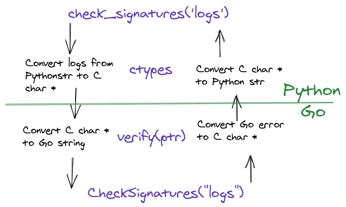

# Go ↔ Python: Part II Extending Python With Go

### Introduction

In [the previous post](https://www.ardanlabs.com/blog/2020/06/python-go-grpc.html) we saw how a Go service can call a Python service using gRPC. Using gRPC to connect a Go and Python program together can be a great choice, but there’s a complexity price that goes with it. You need to manage one more service, deployment becomes more complex, and you need monitoring plus alerting for each service. Compared to a monolithic application, there is an order of magnitude more complexity.

In this post, we're going to reduce the complexity of using gRPC by writing a shared library in Go that a Python program can consume directly. With this approach, there’s no networking involved and depending on the data types, no marshalling as well. Out of the several approaches of calling functions from a shared library in Python, we decided to use Python's [ctypes](https://docs.python.org/3/library/ctypes.html) module.

_Note: ctypes uses [libffi](https://github.com/libffi/libffi) under the hood. If you want to read some really scary C code - head over to the repo and start reading. :)_

I'll also show my workflow that is one of the big factors in my productivity. We'll first write "pure" Go code, then write code to export it to a shared library. Then we'll switch to the Python world and use Python's interactive prompt to Play around with the code. Once we're happy, we'll use what we've learned in the interactive prompt to write a Python module.

### Example: Checking the Digital Signature of Several Files in Parallel

Imagine you have a directory with data files, and you need to validate the integrity of these files. The directory contains a `sha1sum.txt` file with a [sha1](https://en.wikipedia.org/wiki/SHA-1) digital signature for every file. Go, with its concurrency primitives and ability to use all the cores of your machine, is much better suited to this task than Python.

**Listing 1: sha1sum.txt**
```
6659cb84ab403dc85962fc77b9156924bbbaab2c  httpd-00.log
5693325790ee53629d6ed3264760c4463a3615ee  httpd-01.log
fce486edf5251951c7b92a3d5098ea6400bfd63f  httpd-02.log
b5b04eb809e9c737dbb5de76576019e9db1958fd  httpd-03.log
ff0e3f644371d0fbce954dace6f678f9f77c3e08  httpd-04.log
c154b2aa27122c07da77b85165036906fb6cbc3c  httpd-05.log
28fccd72fb6fe88e1665a15df397c1d207de94ef  httpd-06.log
86ed10cd87ac6f9fb62f6c29e82365c614089ae8  httpd-07.log
feaf526473cb2887781f4904bd26f021a91ee9eb  httpd-08.log
330d03af58919dd12b32804d9742b55c7ed16038  httpd-09.log
```

Listing 1 shows an example of a digital signature file. It provides hash codes for all the different log files contained in the directory. This file can be used to verify that a log file was downloaded correctly or has not been tampered with. We’ll write Go code to calculate the hash code of each log file and then match it against the hash code listed in the digital signature file.

To speed this process up, we'll calculate the digital signature of each file in a separate goroutine, spreading the work across all of the CPUs on our machine.

### Architecture Overview & Work Plan

On the Python side of the code, we’re going to write a function named `check_signatures` and on the Go side, we’re going to write a function (that does the actual work) named `CheckSignatures`. In between these two functions, we’ll use the `ctypes` module (on the Python side) and write a `verify` function (on the Go side) to provide marshaling support.


**Figure  1**  



Figure 1 shows the flow of data from the Python function to the Go function and back.

Here are the steps we’re going to follow for the rest of the post:

* Write Go code (`CheckSignature`), 
* Exporting to the shared library (`verify`)
* Use ctypes in the Python interactive prompt to call the Go code
* Write and package the Python code (`check_signatures`)
*  We’ll do this part in the next blog post - this one is already long enough

### Go Code - The “CheckSignatures” Function

I'm not going to break down all of the Go source code here, if you're curious to see all of it, look at this source code  [file](https://github.com/ardanlabs/python-go/blob/master/pyext/checksig.go).

The important part of the code to see now is the definition of the `CheckSignatures` function.

**Listing 2: CheckSignatures function definition**  
```
// CheckSignatures calculates sha1 signatures for files in rootDir and compare
// them with signatures found at "sha1sum.txt" in the same directory. It'll
// return an error if one of the signatures don't match
func CheckSignatures(rootDir string) error {
```

Listing 2 shows the definition of the `CheckSignatures` function. This function will spin a goroutine per file to check if the calculated sha1 signature of any given file matches the one in “sha1sum.txt”. If there is a mismatch in one or more files, the function will return an error.

### Exporting Go Code to a Shared Library

With the Go code written and tested, we can move on to exporting it to a shared library.

Here are the steps we’ll follow in order to compile the Go source code into a shared library so Python can call it:

* import the `C` package (aka [cgo](https://golang.org/cmd/cgo/))
* Use the `//export` directives on every function we need to expose
* Have an empty `main` function
* Build the source code with the special `-buildmode=c-shared` flag

_Note: Apart from the Go toolchain, we’ll also need a C compiler (such as `gcc` on your machine). There’s a good free C compiler for each of the major platforms: `gcc` for Linux, `clang` on OSX (via [XCode](https://developer.apple.com/xcode/resources/)) and [Visual Studio](https://visualstudio.microsoft.com/vs/community/) for Windows_


**Listing 3: export.go**
```
01 package main
02 
03 import "C"
04 
05 //export verify
06 func verify(root *C.char) *C.char {
07 	rootDir := C.GoString(root)
08 	if err := CheckSignatures(rootDir); err != nil {
09 		return C.CString(err.Error())
10 	}
11 
12 	return nil
13 }
14 
15 func main() {}
```

Listing 3 shows the `export.go` file from the project. We import “C” on line 03 and then on line 05, the `verify` function is marked to be exported in the shared library. It’s important that the comment is provided exactly as is. You can see on line 06, the `verify` function accepts a C based string pointer using the C package `char` type. For Go code to work with C strings, the C package provides a `GoString` function (which is used on line 07) and a `CString` function (which is used in line 09). Finally, an empty `main` function is declared at the end.

To build the shared library, you need to run the `go build` command with a special flag.

**Listing 4: Building the Shared Library**
```
$ go build -buildmode=c-shared -o _checksig.so
```

Listing 4 shows the command to generate the C based shared library which will be named `_checksig.so`.

_Note: The reason for using `_` is to avoid name collision with the `checksig.py` Python module that we'll show later. If the shared library was named `checksig.so` then executing `import checksig` in Python will load the shared library instead of the Python file._

### Preparing the Test Data

Before we can try calling `verify` from Python, we need some data. You'll find a directory called [logs](https://github.com/ardanlabs/python-go/tree/master/pyext/testdata/logs) in the code repository. This directory contains some log files and a `sha1sum.txt` file.

_Note: **The signature for `http08.log` is intentionally wrong.**_

On my machine, this directory is located at `/tmp/logs`.

### A Python Session

I love the interactive shell in Python, it lets me play around with code in small chunks. After I have a working version, I write the Python code in a file.

**Listing 5: A Python Session**
```
$ python
Python 3.8.3 (default, May 17 2020, 18:15:42) 
[GCC 10.1.0] on linux
Type "help", "copyright", "credits" or "license" for more information.

01 >>> import ctypes
02 >>> so = ctypes.cdll.LoadLibrary('./_checksig.so')
03 >>> verify = so.verify
04 >>> verify.argtypes = [ctypes.c_char_p]
05 >>> verify.restype = ctypes.c_void_p
06 >>> free = so.free
07 >>> free.argtypes = [ctypes.c_void_p]
08 >>> ptr = verify('/tmp/logs'.encode('utf-8'))
09 >>> out = ctypes.string_at(ptr)
10 >>> free(ptr)
11 >>> print(out.decode('utf-8'))
12 "/tmp/logs/httpd-08.log" - mismatch
```

Listing 6 shows an interactive Python session that walks you through testing the use of the exported to a shared library we wrote in Go.  line 01 we import the `ctypes` module to start. Then on line 06, we load the shared library into memory. On lines 03-05 we load the `verify` function from the shared library and set the input and output types. Lines 06-07 load the `free` function so we can free the memory allocated by Go (see more below).

Line 08 is the actual function call to `verify`. We need to convert the directory name to Python's `bytes` before passing it to the function. The return value, which is a C string, is stored in `ptr`. On line 09, we convert the C string to a Python `bytes` and on line 10 we free the memory allocated by Go. Finally, on line 11, we convert `out` from `bytes` to `str` before printing it.

_Note: Line 02 assumes the shared library, `_checksig.so` is in the current directory. If you started the Python session elsewhere, change the path to the `_checksig.so` in line 02._

With very little effort we're able to call Go code from Python.

### Intermezzo: Sharing Memory Between Go & Python

Both Python & Go have a garbage collector that will automatically free unused memory. However having a garbage collector doesn't mean you can't leak memory.

_Note: You should read Bill's [Garbage Collection In Go](https://www.ardanlabs.com/blog/2018/12/garbage-collection-in-go-part1-semantics.html) blog posts. They will give you a good understanding on garbage collectors in general and on the Go garbage collector specifically._

You need to be extra careful when sharing memory between Go and Python (or C).  Sometimes it's not clear when a memory allocation happens. In `export.go` on line 13, we have the following code:

**Listing 6: Converting Go Error to C String**
```
str := C.CString(err.Error())
```

The [documentation](https://golang.org/cmd/cgo/) for `C.String` says:

**Listing 7**  
```
> // Go string to C string
> // The C string is allocated in the C heap using malloc.
> // **It is the caller's responsibility to arrange for it to be
> // freed**, such as by calling C.free (be sure to include stdlib.h
> // if C.free is needed).
> func C.CString(string) *C.char
```

To avoid a memory leak in our interactive prompt, we loaded the `free` function and used it to free the memory allocated by Go.

### Conclusion

With very little code, you can use Go from Python. Unlike the previous installment, there's no RPC step - meaning you don't need to marshal and unmarshal parameters on every function call and there's no network involved as well. Calling from Python to C this way is much faster than a gRPC call. On the other hand, you need to be more careful with memory management and the packaging process is more complex.

_Note: A simple [benchmark[(https://github.com/ardanlabs/python-go/tree/master/pyext/bench) on my machine clocks gRPC function call at 128µs vs a shared library call at 3.61µs - about 35 times faster._

I hope that you've found this style of writing code: Pure Go first, then exporting and then trying it out in an interactive session appealing. I urge you to try this workflow yourself next time you write some code.

In the next installment, we’ll finish the last step of my workflow and package the Python code as a module.


